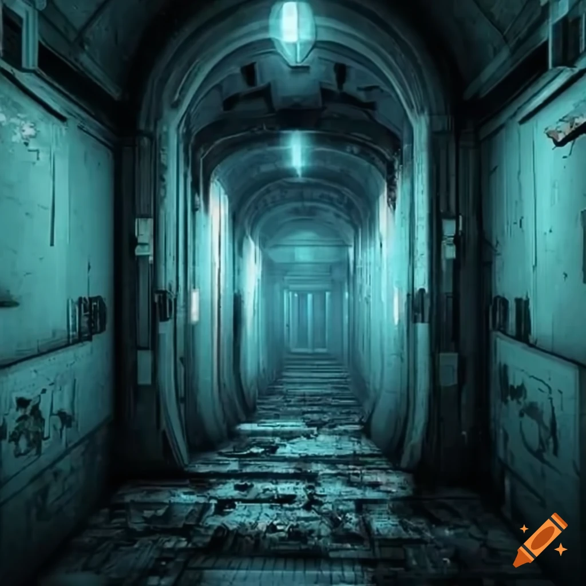

# 
ILiveInABunker

[Github but fancy though](https://scriptgenie.github.io/ILiveInABunker/)

ILiveInABunker is a idle-ish rpg set in a post-apocalyptic nuclear wasteland. Resources are scarce, and retrieving them from the wastes is a gamble every time.

Players will control one or more Bunkers, sites (usually underground) that have managed to stay in a somewhat habitable condition despite the world falling apart. These Bunkers can range from semi-shielded train cars some prepper stuffed in the side of a mountain, to full-on nuclear fallout shelters designed for long-term habitation.

As is life, most things are random. You could start comfortable and stay comfortable, or claw your way to stability from a lead-lined root cellar.

## 
Contributing

TODO. For now any interest is welcome and appreciated. Feel free to tinker and make pull requests. Please include detailed comments and such.

Credit - craiyon.com

 

###### 
Tags

discord bot - idle - rpg - wasteland - survival - post-apocalyptic
